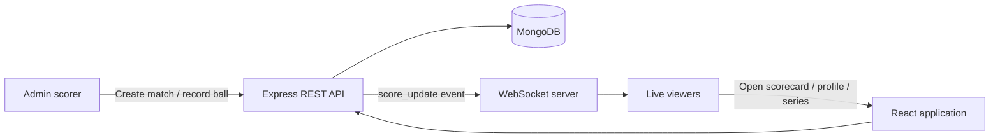

# CricScore

> A real-time cricket scoring and match-following platform for scorers and fans.

CricScore lets an administrator create fixtures, configure playing XIs, record every ball, and publish live score updates to viewers in real time. Fans can follow active matches, detailed scorecards, commentary, player profiles, results, and tournament standings from a responsive web interface.

## Highlights

- Live ball-by-ball scoring with instant WebSocket updates
- Live, upcoming, and completed match dashboard
- Detailed batting and bowling scorecards, over history, and commentary
- Match setup with teams, player roles, and jersey numbers
- Boundary, six, and wicket celebration effects
- Player career profiles and match-result summaries
- Series fixtures and points tables
- Admin authentication with JWT-protected scoring tools
- Responsive day and night themes, plus a reduced-motion preference
- Product walkthrough page with an interactive scoring demo

## How it works



1. An administrator signs in and creates a fixture with teams, players, format, toss, venue, and jersey numbers.
2. The scoring desk records runs, extras, wickets, bowler changes, innings changes, and the final result.
3. The server updates MongoDB, calculates score information, and broadcasts the latest match state over WebSockets.
4. Connected viewers see updates immediately in the live scorecard, including moment effects for boundaries and wickets.
5. Once complete, the match result and player statistics remain available for fans to explore.

## Tech stack

| Area | Technologies |
| --- | --- |
| Frontend | React 18, React Router, Axios, Vite |
| Styling | Tailwind CSS, custom responsive CSS, light/dark theme system |
| Backend | Node.js, Express |
| Database | MongoDB, Mongoose |
| Real-time | `ws` WebSocket server |
| Authentication | JSON Web Tokens, bcryptjs |

## Project structure

```text
CricketScorecard/
├── client/                 # React + Vite single-page application
│   └── src/
│       ├── pages/          # Public, account, and admin screens
│       ├── components/     # Navbar, celebrations, route guard
│       ├── context/        # Authentication and theme state
│       └── hooks/          # WebSocket subscription hook
├── server/                 # Express, MongoDB, and WebSocket service
│   ├── models/             # User, Player, Match, Series schemas
│   ├── routes/             # REST API endpoints
│   ├── middleware/         # JWT and admin middleware
│   └── utils/              # API serializers and scoring helpers
└── server/.env.example     # Safe environment-variable template
```

## Run locally

### Prerequisites

- Node.js 18+
- npm
- MongoDB (local instance or MongoDB Atlas connection string)

### 1. Clone and install

```bash
git clone https://github.com/YOUR_USERNAME/CricketScorecard.git
cd CricketScorecard

cd client && npm install
cd ../server && npm install
```

### 2. Configure the server

Copy the safe template and add your local values:

```bash
cd server
cp .env.example .env
```

Set these variables in `server/.env`:

```env
MONGO_URI=mongodb://127.0.0.1:27017/cricket_scorecard
JWT_SECRET=use-a-long-random-secret-here
PORT=5005
```

> `server/.env` is deliberately ignored by Git. Do not commit real database URLs, passwords, or JWT secrets.

### 3. Start the app

Open two terminals.

```bash
# Terminal 1 — API and WebSocket server
cd server
npm run dev
```

```bash
# Terminal 2 — React application
cd client
npm run dev
```

Open [http://localhost:3000](http://localhost:3000). The Vite development server proxies `/api` and `/ws` requests to `http://localhost:5005`.

## Main routes

| Route | Purpose |
| --- | --- |
| `/` | Match dashboard |
| `/match/:id` | Live scorecard |
| `/match/:id/result` | Completed match result |
| `/series` | Series directory |
| `/player/:id` | Player profile and career stats |
| `/how-it-works` | Product walkthrough and demo |
| `/account` | Authenticated account settings |
| `/admin/login` | Admin login and registration |
| `/admin/matches/new` | Protected match setup |
| `/admin/matches/:id/score` | Protected ball-by-ball scoring desk |

## Available scripts

| Directory | Command | Purpose |
| --- | --- | --- |
| `client` | `npm run dev` | Start Vite development server |
| `client` | `npm run build` | Create production frontend build |
| `client` | `npm run preview` | Preview production frontend build |
| `server` | `npm run dev` | Start backend with nodemon |
| `server` | `npm start` | Start backend with Node.js |

## Security notes

- Keep all secrets in `server/.env`; only commit `server/.env.example`.
- Use a strong unique `JWT_SECRET` outside local development.
- Do not expose MongoDB connection strings in frontend code or public repositories.

## License

This project is currently unlicensed. Add a license file before distributing or accepting contributions.
