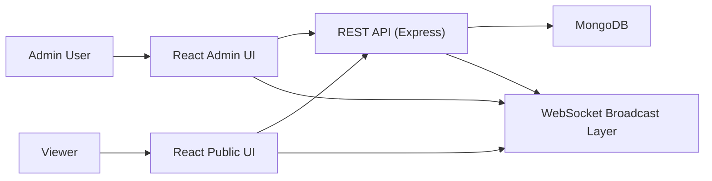

# Cricket Scorecard Project

## Overview

Cricket Scorecard is a full-stack live scoring application for cricket matches.

It provides:

- public match browsing
- live scorecards
- match result pages
- series listing and series detail pages
- player profile pages
- admin authentication
- match setup and ball-by-ball scoring
- WebSocket-based live updates for connected viewers

The project is split into two applications:

- `client/`: React + Vite frontend
- `server/`: Express + MongoDB + WebSocket backend

## Tech Stack

### Frontend

- React 18
- React Router
- Axios
- Vite
- Tailwind CSS

### Backend

- Node.js
- Express
- MongoDB with Mongoose
- JWT authentication
- WebSocket server using `ws`

## High-Level Architecture



## Project Structure

### Client

- `client/src/App.jsx`
  Main route configuration.
- `client/src/pages/`
  Public pages and admin pages.
- `client/src/api/index.js`
  Axios instance and auth token injection.
- `client/src/context/AuthContext.jsx`
  Login, register, logout, auth state.
- `client/src/hooks/useWebSocket.js`
  Match subscription and live update handling.
- `client/src/components/`
  Shared UI pieces like navbar and protected route.

### Server

- `server/index.js`
  Express app, HTTP server, WebSocket server, Mongo connection.
- `server/routes/`
  API route handlers for auth, matches, players, series.
- `server/models/`
  Mongoose schemas for `User`, `Match`, `Player`, `Series`.
- `server/middleware/auth.js`
  JWT verification and admin check.
- `server/utils/serializers.js`
  Compatibility/serialization layer that shapes backend data for the frontend.

## Core Backend Modules

### Match Model

The `Match` model is the center of the application.

It stores:

- match format, status, venue, date
- both teams and their players
- toss result
- innings data
- current innings pointer
- match result
- optional series reference

Each innings stores:

- batting team and bowling team
- total runs, wickets, overs, balls
- extras
- current batsmen
- current bowler
- batting scorecard
- bowling scorecard
- fall of wickets
- over history
- completion state

### Player Model

The `Player` model stores:

- player identity
- team
- role
- batting career stats
- bowling career stats
- optional image

### Series Model

The `Series` model stores:

- series name and format
- participating teams
- linked matches
- points table
- status and schedule dates

## Request and Data Flow

### 1. Admin Authentication Flow

1. User opens `/admin/login`.
2. Registration or login request is sent to `/api/auth/register` or `/api/auth/login`.
3. Server returns a JWT and user payload.
4. Frontend stores the token in local storage.
5. Protected admin routes become accessible.

Note:

- registration currently defaults to an admin role so a fresh local setup can start scoring immediately
- JWT has a fallback development secret if `JWT_SECRET` is not set

### 2. Match Creation Flow

1. Admin opens `/admin/matches/new`.
2. Admin enters teams, players, toss result, format, venue, and date.
3. Frontend sends the match payload to `POST /api/matches`.
4. Backend creates missing players automatically if they do not already exist.
5. Backend converts the frontend payload into the database match structure.
6. The match auto-starts from toss information:
   - batting side is resolved from toss winner + decision
   - opening batsmen are selected from the batting team
   - opening bowler is selected from the bowling team
7. Frontend navigates to the scoring screen.

### 3. Live Scoring Flow

1. Admin uses `/admin/matches/:id/score`.
2. Each ball is submitted to `POST /api/matches/:id/ball`.
3. Backend updates:
   - innings totals
   - striker stats
   - bowler stats
   - scorecards
   - over history
   - wickets and fall of wickets
   - innings completion conditions
4. Backend saves the updated match.
5. Backend serializes the match into the UI-friendly format.
6. Backend broadcasts a `score_update` WebSocket event.
7. Connected viewers update in near real time.

### 4. Bowler Change Flow

1. After an over, the scoring UI asks for the next bowler.
2. Frontend calls `POST /api/matches/:id/bowler`.
3. Backend switches the active bowler and creates a bowling entry if needed.
4. Updated state is returned and broadcast.

### 5. End Innings Flow

1. Admin ends the innings from the scoring screen.
2. Frontend calls `POST /api/matches/:id/end-innings`.
3. Backend marks the innings complete.
4. Backend computes the target.
5. Backend prepares the next innings automatically:
   - next batting team is chosen
   - opening batsmen are chosen from that team
   - opening bowler is chosen from the fielding side
6. Backend broadcasts `innings_change`.

### 6. Match Completion Flow

1. Admin completes the match.
2. Frontend calls `POST /api/matches/:id/complete`.
3. Backend stores:
   - winner
   - summary
   - player of the match
4. Backend finalizes innings.
5. Backend updates player career stats.
6. Backend broadcasts `match_completed`.
7. Result view becomes available at `/match/:id/result`.

## Frontend Rendering Strategy

The frontend expects a "UI-shaped" match object instead of the raw database structure.

The server now provides that through `server/utils/serializers.js`.

Important frontend-facing fields include:

- `teamA`, `teamB`
- `innings[].totalRuns`
- `innings[].totalWickets`
- `innings[].oversDisplay`
- `innings[].batting`
- `innings[].bowling`
- `innings[].currentBatsmen`
- `innings[].currentBowler`
- `innings[].currentRunRate`
- `innings[].requiredRunRate`
- `innings[].target`
- `currentOverBalls`
- `result`
- `playerOfMatch`

This compatibility layer keeps the UI stable while the database keeps a richer internal structure.

## WebSocket Architecture

The backend keeps a room-style map in memory:

- one match id -> many WebSocket clients

When a client opens a match page:

1. frontend connects to WebSocket
2. frontend sends a `subscribe` message with `matchId`
3. server stores that connection in the room for that match
4. score events are broadcast only to subscribed clients

Supported live event categories now include:

- `score_update`
- `innings_change`
- `match_completed`
- `bowler_change`
- `undo_ball`

## Main API Areas

### Auth

- `POST /api/auth/register`
- `POST /api/auth/login`
- `GET /api/auth/me`

### Matches

- `GET /api/matches`
- `GET /api/matches/:id`
- `POST /api/matches`
- `POST /api/matches/:id/start`
- `POST /api/matches/:id/ball`
- `POST /api/matches/:id/bowler`
- `POST /api/matches/:id/end-innings`
- `POST /api/matches/:id/complete`
- `POST /api/matches/:id/undo-ball`
- `POST /api/matches/:id/undo`

### Players

- `GET /api/players`
- `GET /api/players/:id`
- `GET /api/players/:id/stats`
- `POST /api/players`
- `PUT /api/players/:id`

### Series

- `GET /api/series`
- `GET /api/series/:id`
- `POST /api/series`
- `PUT /api/series/:id`
- `POST /api/series/:id/recalculate`

## Running the Project

### Backend

From `server/`:

```bash
npm install
npm run dev
```

Defaults:

- port: `5000`
- Mongo URI fallback: `mongodb://localhost:27017/cricket_scorecard`
- JWT secret fallback: `cricscore-dev-secret`

Recommended environment variables:

```bash
MONGO_URI=mongodb://localhost:27017/cricket_scorecard
JWT_SECRET=change-this-secret
PORT=5000
```

### Frontend

From `client/`:

```bash
npm install
npm run dev
```

Defaults:

- Vite port: `3000`
- `/api` is proxied to `http://localhost:5000`
- `/ws` is proxied to the backend WebSocket server

## Current Working Flow

For a normal local run:

1. Start MongoDB.
2. Start the backend server.
3. Start the frontend dev server.
4. Open the app in the browser.
5. Register an admin user from `/admin/login`.
6. Create a new match from `/admin/matches/new`.
7. Score the match ball by ball.
8. Open the public match page in another tab to see live updates.
9. End innings and complete the match.
10. Review the result page, player profiles, and series pages.

## Important Implementation Notes

- The backend now accepts the frontend's legacy match payload shape and converts it internally.
- Match creation auto-creates players if they are not already in the database.
- The backend response format is now aligned with the current React screens.
- Admin registration is usable out of the box for local setups.
- The client build currently succeeds after these compatibility fixes.

## Verification Completed

- frontend production build completed successfully
- updated backend files pass `node --check`

## Future Improvements

- add automated tests for scoring rules and innings transitions
- improve undo-ball logic by storing event history or snapshots
- add explicit series management in the admin UI
- support richer Test match innings flows
- add seed scripts for demo teams and players
